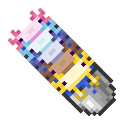

# Axolotl Variants

Adds identifying textures for Bucket of Axolotls and different Axolotl variants!

**This resource pack requires Optifine CIT or compatible.**

## Download and Installation
- Download the [latest release](https://github.com/drunderscore/axolotl_variants/releases/latest)
- Place this file within your resource packs directory. Find this directory by...
    - Clicking the `Options` button
    - Clicking the `Resource Packs...` button
    - Clicking the `Open Pack Folder` button, in the bottom-left